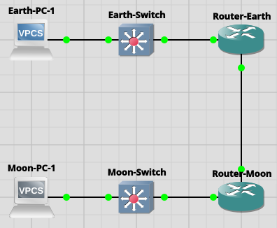

# Basic linked technology through multiple routers in GNS3
### Appliances Decision
---
- __Routeing__:
	- For the router we are using VyOS to allow for complex routing, space laser delay, and simulated networking
- __Lab Computers__
	- GNS3 VPCs for lap computers
	- Automatically built in with one Ethernet port
	- Can simulate networking and be assigned ips
	- Very low RAM usage so light on GNS3 VM
- __Switches__
	- Use Openvswitch for customization and many usage cases
### Topology Design
---
For a basic topology design we simulated a single pc on the earth side and the moon side, each connected through a switch and a router to allow for scalability in the future



### Network Design
---
Earth - 10.10.10.10/24
- Allows for a full network on earth
Moon - 10.20.10.10/24
- Allows for a full network on the moon similar to earth
Link - 10.254.0.0/30
- Separate link ip to broadcast, and only need two addresses 10.254.0.1 and 10.254.0.2 for the routers sending info
Networks are linked through ospf so works dynamically instead of just defining explicit ip links such as pinging moon pc from earth pc jumps to the exact ip through the router
### Testing
---
__Router Config__
Moon-Router
```
eth0: flags=4163<UP,BROADCAST,RUNNING,MULTICAST>  mtu 1500  
       inet 10.20.10.1  netmask 255.255.255.0  broadcast 10.20.10.255  
       inet6 fe80::ec6:83ff:fe39:0  prefixlen 64  scopeid 0x20<link>  
       ether 0c:c6:83:39:00:00  txqueuelen 1000  (Ethernet)  
       RX packets 63  bytes 5368 (5.2 KiB)  
       RX errors 0  dropped 0  overruns 0  frame 0  
       TX packets 40  bytes 4152 (4.0 KiB)  
       TX errors 0  dropped 0 overruns 0  carrier 0  collisions 0  
  
eth1: flags=4163<UP,BROADCAST,RUNNING,MULTICAST>  mtu 1500  
       inet 10.254.0.2  netmask 255.255.255.252  broadcast 10.254.0.3  
       inet6 fe80::ec6:83ff:fe39:1  prefixlen 64  scopeid 0x20<link>  
       ether 0c:c6:83:39:00:01  txqueuelen 1000  (Ethernet)  
       RX packets 41  bytes 3714 (3.6 KiB)  
       RX errors 0  dropped 0  overruns 0  frame 0  
       TX packets 48  bytes 4624 (4.5 KiB)  
       TX errors 0  dropped 0 overruns 0  carrier 0  collisions 0
```
Eth0 as the lan interfacing with moon network, and eth1 as a simulation for the broadcast to earth

Similar for earth router
```
eth0: flags=4163<UP,BROADCAST,RUNNING,MULTICAST>  mtu 1500  
       inet 10.10.10.1  netmask 255.255.255.0  broadcast 10.10.10.255  
       inet6 fe80::ef4:c4ff:fe3f:0  prefixlen 64  scopeid 0x20<link>  
       ether 0c:f4:c4:3f:00:00  txqueuelen 1000  (Ethernet)  
       RX packets 76  bytes 6556 (6.4 KiB)  
       RX errors 0  dropped 0  overruns 0  frame 0  
       TX packets 53  bytes 5470 (5.3 KiB)  
       TX errors 0  dropped 0 overruns 0  carrier 0  collisions 0  
  
eth1: flags=4163<UP,BROADCAST,RUNNING,MULTICAST>  mtu 1500  
       inet 10.254.0.1  netmask 255.255.255.252  broadcast 10.254.0.3  
       inet6 fe80::ef4:c4ff:fe3f:1  prefixlen 64  scopeid 0x20<link>  
       ether 0c:f4:c4:3f:00:01  txqueuelen 1000  (Ethernet)  
       RX packets 42  bytes 3928 (3.8 KiB)  
       RX errors 0  dropped 0  overruns 0  frame 0  
       TX packets 48  bytes 4540 (4.4 KiB)  
       TX errors 0  dropped 0 overruns 0  carrier 0  collisions 0
```

__Ping Testing__
Earth PC can ping moon PC on static switching

Earth PC IP
```
NAME        : Earth-PC-1[1]  
IP/MASK     : 10.10.10.10/24  
GATEWAY     : 10.10.10.1  
DNS         :    
MAC         : 00:50:79:66:68:00  
LPORT       : 20010  
RHOST:PORT  : 127.0.0.1:20011  
MTU         : 1500
```

Moon PC IP:
```
NAME        : Moon-PC-1[1]  
IP/MASK     : 10.20.10.10/24  
GATEWAY     : 10.20.10.1  
DNS         :    
MAC         : 00:50:79:66:68:01  
LPORT       : 20012  
RHOST:PORT  : 127.0.0.1:20013  
MTU         : 1500
```

Ping and trace route to Moon PC from Earth PC:
- Ping:
```
Earth-PC-1> ping 10.20.10.10  
  
84 bytes from 10.20.10.10 icmp_seq=1 ttl=62 time=10.277 ms  
84 bytes from 10.20.10.10 icmp_seq=2 ttl=62 time=5.294 ms  
84 bytes from 10.20.10.10 icmp_seq=3 ttl=62 time=7.307 ms  
84 bytes from 10.20.10.10 icmp_seq=4 ttl=62 time=6.900 ms  
84 bytes from 10.20.10.10 icmp_seq=5 ttl=62 time=6.287 ms
```
- Trace Route:
```
Earth-PC-1> trace 10.20.10.10  
trace to 10.20.10.10, 8 hops max, press Ctrl+C to stop  
1   10.10.10.1   3.731 ms  4.222 ms  2.243 ms  
2   10.254.0.2   2.381 ms  2.384 ms  2.410 ms  
3   *10.20.10.10   7.177 ms (ICMP type:3, code:3, Destination port unreachable)
```

Ping and trace route to Earth PC from Moon PC:
- Ping
```
Moon-PC-1> ping 10.10.10.10  
  
84 bytes from 10.10.10.10 icmp_seq=1 ttl=62 time=14.447 ms  
84 bytes from 10.10.10.10 icmp_seq=2 ttl=62 time=6.175 ms  
84 bytes from 10.10.10.10 icmp_seq=3 ttl=62 time=6.902 ms  
84 bytes from 10.10.10.10 icmp_seq=4 ttl=62 time=9.357 ms  
84 bytes from 10.10.10.10 icmp_seq=5 ttl=62 time=7.407 ms
```
- Trace
```
Moon-PC-1> trace 10.10.10.10  
trace to 10.10.10.10, 8 hops max, press Ctrl+C to stop  
1   10.20.10.1   3.441 ms  1.432 ms  1.753 ms  
2   10.254.0.1   4.542 ms  3.999 ms  4.568 ms  
3   *10.10.10.10   8.196 ms (ICMP type:3, code:3, Destination port unreachable)
```
